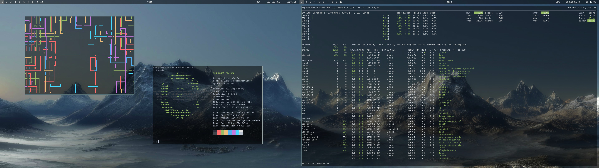
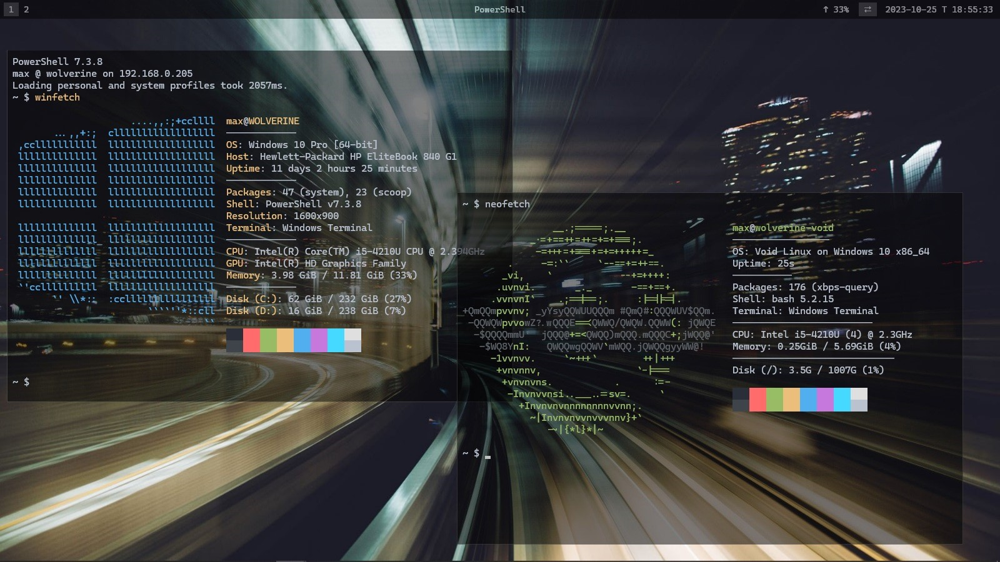

# dotfiles

## Images

### nightcrawler2



### wolverine



## Usage

### Install [`dotter`](https://github.com/SuperCuber/dotter):

<table>
  <tr>
    <td>
      <details><summary><h4>Void</h4></summary><pre># cd ~/source/void-packages<br># git checkout add_dotter<br>./xbps-src pkg dotter<br>xi -y dotter</pre></details>
    </td>
    <td>
      <details><summary><h4>Arch</h4></summary><pre>yay -S dotter-rs-bin</pre></details>
    </td>
    <td>
      <details><summary><h4>Windows</h4></summary><pre>scoop install dotter</pre></details>
    </td>
    <td>
      <details><summary><h4>Alpine</h4></summary><pre>apk add wget<br>wget https://github.com/SuperCuber/dotter/releases/latest/download/dotter<br>mv ./dotter /usr/local/bin/<br>chmod 755 /usr/local/bin/dotter</pre></details>
    </td>
    <td>
      <details><summary><h4><i>other</i></h4></summary><pre>wget https://github.com/SuperCuber/dotter/releases/latest/download/dotter<br>sudo mv ./dotter /usr/local/bin/<br>sudo chmod 755 /usr/local/bin/dotter</pre></details>
    </td>
  </tr>
</table>

### Create host-specific config:

```shell
cp ./.dotter/default.toml ./.dotter/$(HOSTNAME).toml
```

### Deploy configs:

```shell
dotter deploy --force --verbose
```

## Hosts

| hostname             | desc                  | OS                                    | machine name                  |
| -------------------- | --------------------- | ------------------------------------- | ----------------------------- |
| **nightcrawler2**    | desktop               | Void Linux                            | HP Z240 SFF Workstation       |
| **wolverine**        | laptop                | Windows 10 Pro                        | HP Elitebook 840 G1           |
| **wolverine-void**   | wsl @laptop           | Void Linux on Windows 10              | *WSL 2.0.9.0*                 |
| **pve1**             | home server host      | Proxmox VE 8.0.3                      | HP EliteDesk 800 G2 DM 65W    |
| **mimic5**           | minecraft BDS ct      | Debian GNU/Linux 12 (bookworm)        | *Proxmox VE 8.0.3*            |
| **irc2**             | irc client ct         | Alpine Linux edge                     | *Proxmox VE 8.0.3*            |
| **polaris**          | file server ct        | Alpine Linux edge                     | *Proxmox VE 8.0.3*            |
| **win11-1**          | vm @desktop           | Windows 11 Pro                        | *QEMU emulator version 8.1.0* |
| **steam-box-1**      | steam ct @desktop     | Arch Linux                            | *LXD 5.9*                     |
| **rosa**             | rpi for ROSA project  | Raspberry Pi OS Lite 12 (bookworm)    | Raspberry Pi Zero 2 W         |
