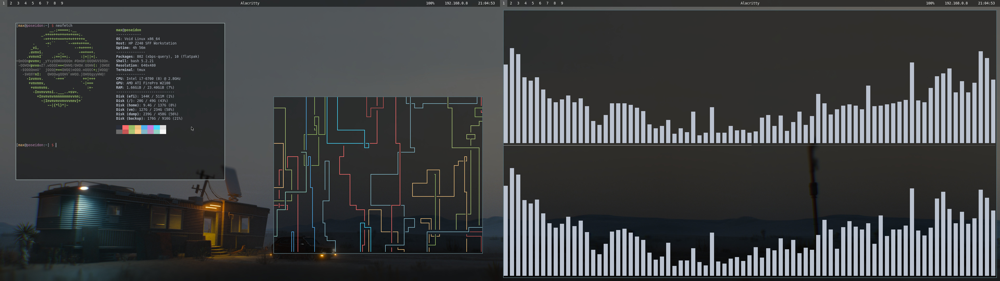
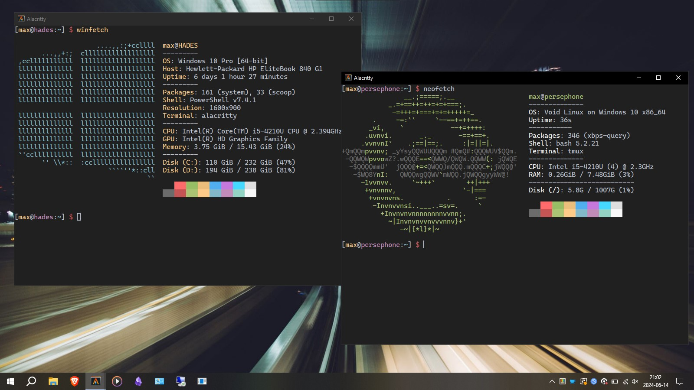
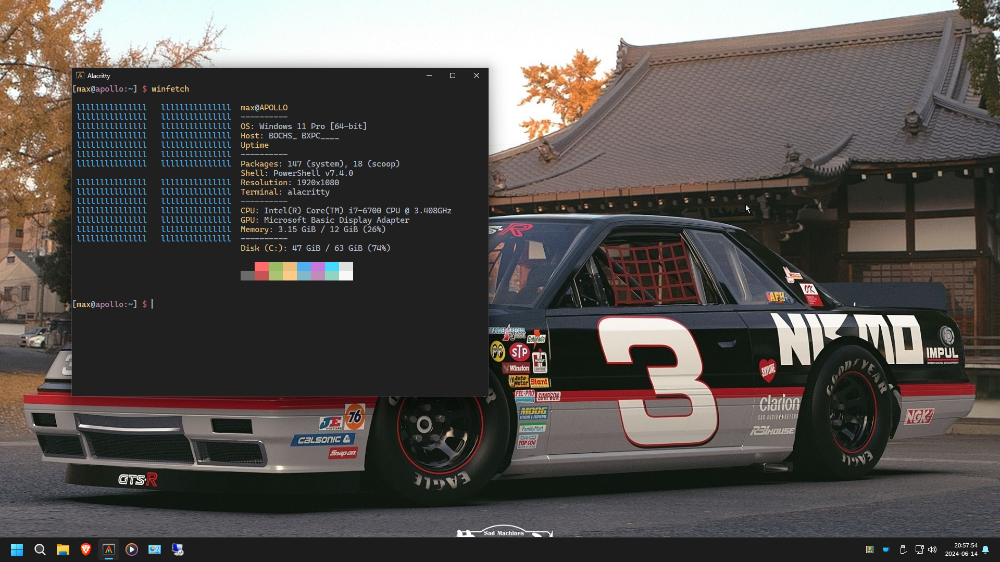
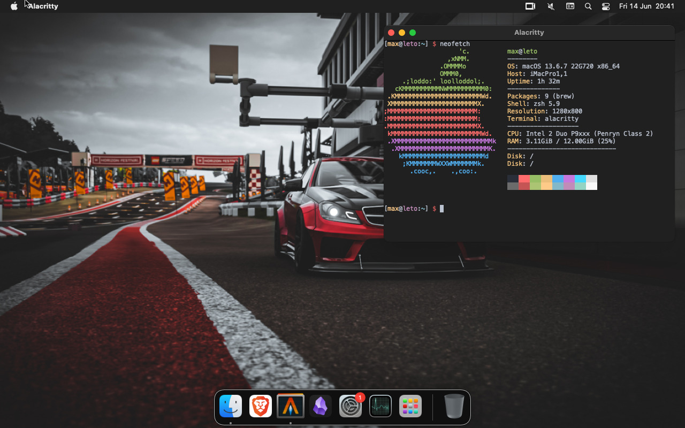

# dotfiles

## Images

### Poseidon



### Hades & Persephone



### Apollo



### Leto



## Usage

### Unix

```shell
./bin/dotter deploy --force --verbose
```

### Unix ARM

```shell
./bin/dotter.arm deploy --force --verbose
```

### Windows

```shell
.\bin\dotter.exe deploy --force --verbose
```

## Hosts

| hostname             | desc                  | OS                                    | machine name                  |
| -------------------- | --------------------- | ------------------------------------- | ----------------------------- |
| **poseidon**         | desktop               | Void Linux                            | HP Z240 SFF Workstation       |
| **hades**            | laptop                | Windows 10 Pro                        | HP Elitebook 840 G1           |
| **persephone**       | wsl @laptop           | Void Linux on Windows 10              | *WSL 2.0.9.0*                 |
| **zeus**             | home server host      | Proxmox VE 8.1.10                     | HP EliteDesk 800 G2 DM 65W    |
| **mnemosyne**        | backup server         | Proxmox Backup Server 3.1-4           | HP EliteDesk 800 G2 DM 65W    |
| **dionysus**         | minecraft BDS         | Debian GNU/Linux 12 (bookworm)        | *Proxmox VE 8.1.10*           |
| **athena**           | file server           | Alpine Linux edge                     | *Proxmox VE 8.1.10*           |
| **iris**             | irc client            | Alpine Linux edge                     | *Proxmox VE 8.1.10*           |
| **hectia**           | dashboard             | Alpine Linux edge                     | *Proxmox VE 8.1.10*           |
| **hephaestus**       | build server          | Alpine Linux edge                     | *Proxmox VE 8.1.10*           |
| **clio**             | temp backup server    | Devuan GNU/Linux 4 (chimaera)         | *Proxmox VE 8.1.10*           |
| **apollo**           | vm @desktop           | Windows 11 Pro                        | *QEMU emulator version 8.1.0* |
| **leto**             | vm @desktop           | macOS 13.6.7 22G720                   | *QEMU emulator version 8.1.0* |
